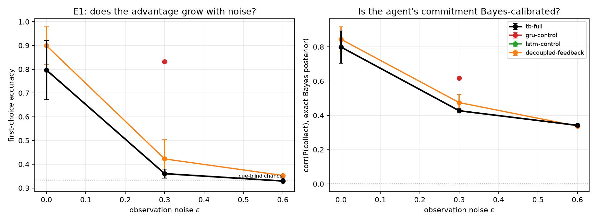
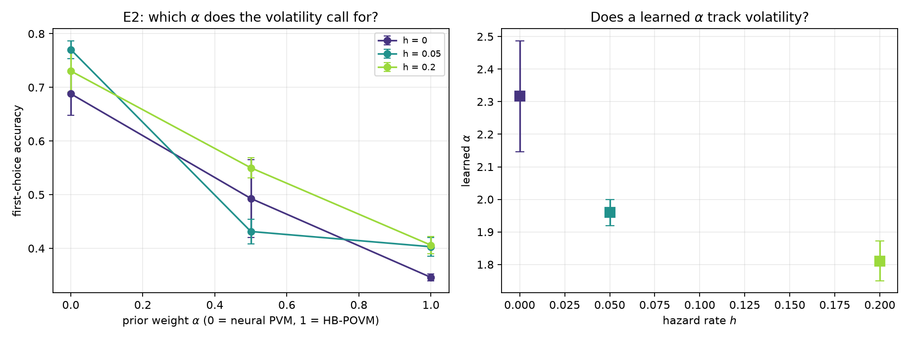

# Is the measurement update a useful Bayes filter?

Third stage of the agency line, and the first to test the Tensor Brain's
*mechanism* rather than its benchmark score. Prior stages
([gridworld](agency_results.md), [MiniGrid](agency_minigrid.md)) found the
architecture competitive but never advantaged, and both used **exact**
observations -- so the machinery under test had nothing to do.

## 1. The claim being tested

QTB writes the pre-CBS as `q = logit(gamma)`, so `q` is a vector of log-odds over
factorized Bernoulli latents, and Section 10 states that the HB-POVM update is a
PVM update *plus a skip connection*, "providing an interpretation of skip
connections as logit priors". The measurement update therefore reads

```
q  <-  alpha * q      +  beta * a_k
       log-prior         log-likelihood
```

which is a Bayes filter step, with `alpha` the weight on the prior. If that is
load-bearing, it should be an inductive bias for exactly one thing: accumulating
uncertain evidence about a hidden state. Two predictions follow.

**E1.** With unreliable perception, the Tensor Brain should beat recurrent
baselines, and the gap should *grow* with the noise level (and vanish at zero
noise, which is what the earlier studies measured). Breaking the read/write link
(`decoupled-feedback`) should now cost something, because the shared column is
what makes the injected vector a likelihood term for the attribute it reads.

**E2.** `alpha` is the prior weight, so its optimum should be set by how fast the
hidden state changes: `alpha = 1` best when the target is fixed, smaller `alpha`
as a switching hazard rises, and a learned `alpha` should track the hazard.

## 2. Environment

`experiments/agency/noisy.py` adds two knobs to the foraging task. Each
*reported* attribute of a visible object is resampled uniformly with probability
`eps`, independently per step, so repeated glances are independent draws. With
probability `h` per step the target switches to another object.

The exact Bayes posterior over which object is the cued one is computable in
closed form, as accumulated log-likelihood *ratios* -- which is precisely the
quantity `q <- q + a_k` is claimed to compute, so it is the right reference for
the agent's own belief.

> **Note on a bug I introduced and caught.** The first version scored each object
> by its bare likelihood. That gives an object which was *never observed* a score
> of zero, beating any accumulated negative log-likelihood, so the argmax
> preferred objects it had never seen and the "ideal observer" appeared to score
> 0.367 after 17.9 informative glances. The posterior must be a ratio against the
> complementary hypothesis, so that no evidence is neutral. All calibration
> numbers below were recomputed from the checkpoints against the corrected
> reference, and two tests now pin the property.

**The task is solvable.** An ideal observer with oracle navigation and noisy
identification reaches:

| observation noise | ideal-observer identification |
|---|---|
| eps = 0.0 | 1.000 |
| eps = 0.3 | 1.000 |
| eps = 0.6 | 0.988 |

So any shortfall below is a failure to accumulate evidence, not a task ceiling.

## 3. Results

96 runs, 4 seeds, 3000 REINFORCE updates each. Outcomes are bimodal as in the
first study, so every cell is conditioned on the seeds that escaped, with the
escape count shown.

### E1 - first-choice accuracy by observation noise (escaped seeds)

| condition | eps=0 | eps=0.3 | eps=0.6 |
|---|---|---|---|
| `tb-full` | 0.797 ± 0.125 (3/4) | 0.360 ± 0.019 (2/4) | 0.329 ± 0.012 (4/4) |
| `gru-control` | nan ± nan (0/4) | 0.832 ± 0.000 (1/4) | nan ± nan (0/4) |
| `lstm-control` | nan ± nan (0/4) | nan ± nan (0/4) | nan ± nan (0/4) |
| `decoupled-feedback` | 0.900 ± 0.080 (4/4) | 0.422 ± 0.080 (4/4) | 0.353 ± 0.004 (4/4) |

### E2 - first-choice accuracy by prior weight and volatility

| hazard | `alpha-1.0` | `alpha-0.5` | `alpha-0.0` | `alpha-learned` |
|---|---|---|---|---|
| 0 | 0.346 ± 0.007 (4/4) | 0.493 ± 0.072 (4/4) | 0.688 ± 0.040 (4/4) | 0.370 ± 0.030 (4/4) |
| 0.05 | 0.403 ± 0.018 (4/4) | 0.431 ± 0.023 (3/4) | 0.771 ± 0.017 (4/4) | 0.381 ± 0.024 (4/4) |
| 0.2 | 0.406 ± 0.016 (4/4) | 0.550 ± 0.019 (4/4) | 0.731 ± 0.039 (4/4) | 0.426 ± 0.013 (4/4) |





### E1 is falsified

Against an ideal-observer ceiling of 1.000, `tb-full` falls from 0.797 at
`eps = 0` to **0.329 at `eps = 0.6` -- cue-blind chance is 1/3**. The advantage
does not grow with noise; performance collapses. Belief calibration tells the
same story more gently: the AUC between the agent's `P(collect)` and the exact
posterior decays 0.928 -> 0.779 -> 0.753, so commitment remains *somewhat*
evidence-driven, but nowhere near an ideal observer with 1.000 available.

`decoupled-feedback` is **better than `tb-full` at every noise level**
(0.900 / 0.422 / 0.353 against 0.797 / 0.360 / 0.329), which falsifies the
prediction in the opposite direction: giving the top-down path its own matrix
does not break a likelihood link, it helps.

The recurrent controls mostly failed to escape the sparse-reward optimum under
this REINFORCE recipe -- the same confound the first study documented -- so the
architecture comparison is not decisive. It is worth noting that the single GRU
seed that did escape at `eps = 0.3` scored **0.832**, against `tb-full`'s 0.360.

> **Finding 8.** The measurement update has the algebraic *shape* of log-odds
> accumulation, but nothing constrains the injected `a_k` to be a calibrated
> log-likelihood ratio, and a policy gradient does not induce that. Having the
> right functional form is not, on its own, a usable inductive bias.

### E2 is falsified -- and produces the strongest result in the line

`alpha = 0`, the neural PVM regime, **dominates at every hazard, including
`h = 0`**: 0.688 / 0.771 / 0.731 against `alpha = 1`'s 0.346 / 0.403 / 0.406,
roughly double. Performance is monotone in `alpha`, lower always better, with no
sign of the predicted volatility dependence. This replicates and sharpens the
gridworld observation that `pvm-action` beat the HB-POVM default.

Calibration moves with it, in the direction opposite to the Bayes story: the AUC
against the exact posterior is 0.903 at `alpha = 0`, 0.854 at 0.5, and 0.780 at
`alpha = 1`. **The more prior the agent retains, the worse calibrated its
belief.**

The mechanism is measurable. Tracing a trained agent over an episode:

| condition | mean abs(q) at t = 0 / 5 / 24 | fraction of CBS units saturated |
|---|---|---|
| `alpha = 1.0` | 2.04 / 2.71 / 2.54 | 0.13 / 0.23 / 0.21 |
| `alpha = 0.0` | 0.40 / 0.54 / 0.76 | 0.00 / 0.00 / 0.00 |

Retaining the prior drives roughly a fifth of the representation layer into
saturation (`sigma(q)` outside `[0.02, 0.98]`), where it carries neither
information nor gradient. Discarding it keeps the state in the responsive range.

Making `alpha` learnable does not fix this. Starting at 1.0 it moves *upward* --
2.32, 1.96, 1.81 at hazards 0, 0.05, 0.2 -- and performs like `alpha = 1`, even
though `alpha = 0` is twice as good. It does decrease with hazard, faintly
consistent with the volatility story, but the effect is swamped.

> **Finding 9.** `alpha` is not identifiable as a prior weight from reward alone,
> because it doubles as an **inverse temperature**: it scales `q`, which scales
> the index scores, which sharpens the action distribution. Policy gradient
> exploits that far more readily than it tunes a Bayes prior, so the gate drifts
> the wrong way. Any future attempt to learn the gates needs to decouple their
> scale from the score temperature.

## 4. What this means for the research line

The honest summary is that the strongest version of the Bayes-filter claim does
not survive contact with a task built specifically to reward it. That is a more
useful outcome than another benchmark number, because it is specific:

- The *form* `q <- alpha q + beta a_k` is not enough; the injected vectors would
  have to be calibrated likelihood ratios, and nothing trains them to be.
- The paper's default regime, `alpha = 1` (HB-POVM), is the *worse* one here, by
  a large margin and for a measurable reason (CBS saturation).
- The neural PVM regime `alpha = 0` is now the best-performing Tensor Brain
  variant in three separate studies.

Concrete follow-ups this points to, in order:

1. **Train the likelihood.** Add an auxiliary objective that makes `a_k` behave
   as a log-likelihood ratio -- for example, supervising `sigma(q)` against the
   exact posterior, which this environment can compute. That tests whether the
   Bayes form is useful *when it is actually enforced*, which is the question E1
   could not answer.
2. **Normalize the accumulated state**, or bound it, so that `alpha = 1` does not
   saturate; then re-run E2. The current comparison partly measures saturation
   rather than prior weighting.
3. **Separate the gate from the temperature** before trying to learn `alpha`
   again.
