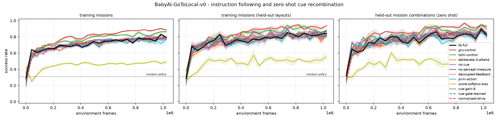
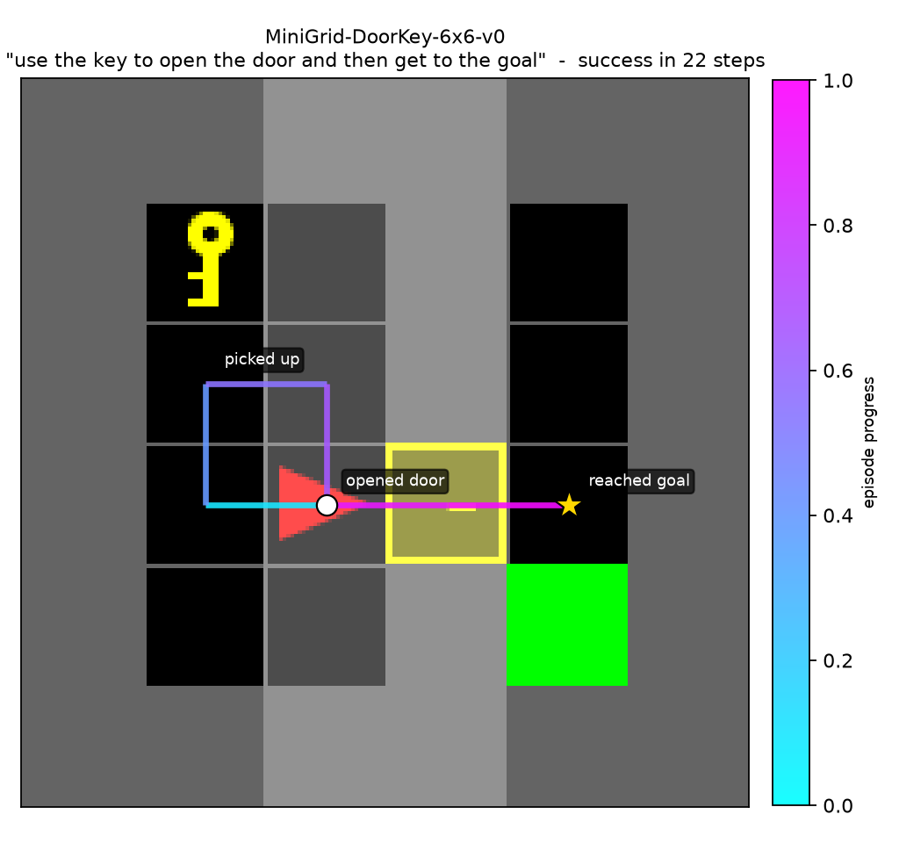

# Action Indices on BabyAI / MiniGrid

Second stage of the agency research line. [`agency_design.md`](agency_design.md) §3.3 committed to
MiniGrid as the next environment, and [`agency_results.md`](agency_results.md) §8 gave the reason:
three of the gridworld findings were bottlenecked on a task we designed ourselves. This document
records what happened on a benchmark we did not.

## 0. Reproduce

```bash
uv sync --extra minigrid

for seed in 0 1 2; do
  for level in gotolocal doorkey pickupstrict; do
    for condition in $(uv run python -c \
        "from experiments.agency.minigrid.conditions import LEVEL_CONDITIONS as L; print(*L['$level'])"); do
      uv run python -m experiments.agency.minigrid.run --level "$level" \
        --condition "$condition" --seed "$seed" --output-root runs/agency/minigrid
    done
  done
done

# Does any trained policy actually use the instruction?
for level in gotolocal pickupstrict; do
  uv run python -m experiments.agency.minigrid.run_cue_ablation --level "$level" \
    --grid-root runs/agency/minigrid --output "runs/agency/minigrid_cue_ablation_$level.json"
done

uv run python -m experiments.agency.minigrid.run_figures \
  --grid-root runs/agency/minigrid --figure-root docs/figures/agency/minigrid
```

## 1. Was the existing code enough?

Almost. Two things were needed, and only one of them was about the Tensor Brain.

**`src/tb` was again untouched.** More than that: the schedule turned out to already support what
a stronger optimizer needs. Recurrent PPO must re-evaluate a stored rollout segment under updated
parameters, which requires reproducing the recurrent state *exactly*; because ``window_cycle`` can
teacher-force both the action index and the two perceptual index samples, a segment replays
bit-for-bit. `tests/test_agency_minigrid.py::test_replay_reproduces_the_collected_log_probabilities`
asserts that an unchanged policy returns its collected log-probabilities to `1e-5`. The one
restriction is that `deliberation_mode="measure"` samples an extra index that is not stored, so PPO
rejects it; `attend` is deterministic given the state and replays fine.

**REINFORCE was the blocker.** The gridworld results were dominated by whether a seed escaped the
sparse-reward local optimum at all. MiniGrid levels are longer and sparser, so a stronger estimator
was a prerequisite rather than a refinement. `experiments/agency/minigrid/ppo.py` implements
recurrent PPO with GAE.

**Two ordinary engineering gaps.** MiniGrid environments are per-instance Python objects, so a
batched adapter was needed; and `TensorBrainAgent` was extracted from `GridAgent` so that the two
environments share one copy of the concept-window schedule instead of two that could drift.

## 2. Why this benchmark

MiniGrid is an unusually good fit for an index layer, and not because we arranged it that way.
Its observation is *already symbolic*: each of the 7x7 egocentric cells is a triple of integer
codes for object type, colour and state. BabyAI missions are generated from a small grammar over
those same symbols. So the same column of `A` is

* the perceptual label "the attended cell contains a ball", and
* the instruction "go to the ball", parsed straight out of the mission string,

with nothing invented to connect them. The gridworld had to be designed to make that true; here it
falls out of the benchmark. The perceptual target is computed from the agent's own view, never from
simulator state, so naming is solvable from what the agent sees.

Three levels, chosen for what they test rather than for difficulty. The third was
added during the study, once the shuffled-mission control showed the first could not
test what it was included for:

| level | environment | tests | random policy |
|---|---|---|---|
| `gotolocal` | `BabyAI-GoToLocal-v0` | per-episode language instruction; held-out colour x object combinations | 0.31 |
| `doorkey` | `MiniGrid-DoorKey-6x6-v0` | sparse reward, forced sub-goal order: fetch key, unlock door, cross, reach goal | 0.02 |
| `pickupstrict` | `TB-PickupLocStrict-v0` | instruction grounding where picking the wrong object ends the episode | 0.10 |

The compositional split is built from each level's *real* instruction distribution: missions are
sampled to discover which `(colour, object)` combinations the level generates, one combination per
object type is held out, and layouts are resampled until an allowed mission appears. Held-out
objects still populate the room as distractors, so only the instruction distribution differs.

DoorKey's mission is the same string in every episode, so its cue carries no per-episode
information and `no-cue` is not run there; the level tests sequencing and memory instead.

## 3. Results

Three levels, 3 seeds each, 81 PPO runs. Full tables in
`docs/figures/agency/minigrid/summary_table.md`.

### gotolocal (`BabyAI-GoToLocal-v0`)

| condition | seeds | success | held-out missions | return | steps |
|---|---|---|---|---|---|
| `tb-full` | 3 | 0.793 ± 0.007 | 0.824 ± 0.027 | 0.574 | 28.9 |
| `gru-control` | 3 | 0.885 ± 0.003 | 0.927 ± 0.009 | 0.690 | 21.2 |
| `lstm-control` | 3 | 0.863 ± 0.011 | 0.896 ± 0.011 | 0.667 | 22.7 |
| `deliberate-3-attend` | 3 | 0.790 ± 0.009 | 0.850 ± 0.011 | 0.569 | 29.1 |
| `no-cue` | 3 | 0.772 ± 0.004 | 0.807 ± 0.015 | 0.561 | 29.6 |
| `no-percept-measure` | 3 | 0.780 ± 0.020 | 0.828 ± 0.041 | 0.578 | 28.4 |
| `decoupled-feedback` | 3 | 0.780 ± 0.012 | 0.823 ± 0.038 | 0.579 | 28.4 |
| `pvm-action` | 3 | 0.768 ± 0.037 | 0.809 ± 0.044 | 0.553 | 30.2 |
| `score-softplus-bias` | 3 | 0.490 ± 0.020 | 0.531 ± 0.032 | 0.322 | 44.6 |
| `cue-gain-8` | 3 | 0.776 ± 0.020 | 0.839 ± 0.019 | 0.558 | 29.8 |
| `cue-gate-learned` | 3 | 0.784 ± 0.006 | 0.812 ± 0.032 | 0.593 | 27.4 |
| `normalized-drive` | 3 | 0.783 ± 0.017 | 0.844 ± 0.015 | 0.576 | 28.6 |

### doorkey (`MiniGrid-DoorKey-6x6-v0`)

| condition | seeds | success | return | steps |
|---|---|---|---|---|
| `tb-full` | 3 | 1.000 ± 0.000 | 0.966 | 13.8 |
| `gru-control` | 3 | 1.000 ± 0.000 | 0.965 | 14.0 |
| `lstm-control` | 3 | 1.000 ± 0.000 | 0.966 | 13.7 |
| `deliberate-3-attend` | 3 | 1.000 ± 0.000 | 0.967 | 13.1 |
| `no-percept-measure` | 3 | 1.000 ± 0.000 | 0.965 | 14.0 |
| `decoupled-feedback` | 3 | 1.000 ± 0.000 | 0.966 | 13.6 |
| `pvm-action` | 3 | 1.000 ± 0.000 | 0.966 | 13.5 |
| `score-softplus-bias` | 3 | 0.204 ± 0.058 | 0.099 | 328.6 |

### pickupstrict (`TB-PickupLocStrict-v0`)

| condition | seeds | success | held-out missions | return | steps |
|---|---|---|---|---|---|
| `tb-full` | 3 | 0.198 ± 0.011 | 0.174 ± 0.004 | 0.175 | 9.6 |
| `no-cue` | 3 | 0.202 ± 0.004 | 0.149 ± 0.004 | 0.173 | 9.7 |
| `gru-control` | 3 | 0.190 ± 0.013 | 0.150 ± 0.033 | 0.169 | 7.6 |
| `lstm-control` | 3 | 0.210 ± 0.008 | 0.181 ± 0.006 | 0.185 | 8.6 |
| `deliberate-3-attend` | 3 | 0.182 ± 0.007 | 0.155 ± 0.016 | 0.159 | 9.5 |
| `no-percept-measure` | 3 | 0.210 ± 0.009 | 0.156 ± 0.039 | 0.184 | 8.6 |
| `decoupled-feedback` | 3 | 0.197 ± 0.018 | 0.193 ± 0.019 | 0.171 | 8.8 |




### DoorKey is solved by everything -- except one score mode

Every architecture reaches **1.000** success on `MiniGrid-DoorKey-6x6-v0`: the
Tensor Brain reference, all its ablations, and both recurrent controls, in
13-14 steps against a random baseline of 0.02. Sparse-reward sub-goal sequencing
-- fetch the key, unlock the door, cross, reach the goal -- is not a
discriminating task at this scale.



The exception is `score-softplus-bias` at **0.204**. In the gridworld study that
score mode never escaped the initial local optimum on any of six seeds, and it
was flagged as a suspected discrepancy with the caveat that it might be an
artifact of REINFORCE. It is not: the same mode fails on a different benchmark
under a different estimator, in the one setting where every other condition is
at ceiling.

> **Finding 5.** QTB's factorized-Bernoulli normalizer
> `a0,k = -sum_l softplus(a_l,k)` is not a neutral reparameterization of the
> score. It costs ~0.80 success on a task all other score modes solve
> completely. This now has two independent replications and deserves a proper
> investigation of the offset's scale rather than a workaround.

### No policy on the GoTo levels uses the instruction -- including the controls

`tb-full` (0.793) scoring the same as `no-cue` (0.772) on `BabyAI-GoToLocal-v0`
looked like a Tensor Brain failure, and I proposed a mechanism: the instruction
enters as a column of `A` whose norm is fixed by initialization, while the
encoder drive is whatever the encoder produces. Measured on this level:

| | view drive RMS | cue RMS | ratio |
|---|---|---|---|
| gridworld, initialization | 0.164 | 0.183 | 0.9x |
| MiniGrid, initialization | 1.044 | 0.168 | 6.2x |
| MiniGrid, after training | 4.851 | 0.175 | 27.7x |

QTB Equation 46 gates each input source separately and leaves the gates to the
experiment, so three conditions tested it: a fixed gate (`cue-gain-8`), a learned
scalar gate (`cue-gate-learned`), and the repository's PVSG normalization applied
to the encoder output (`normalized-drive`). **None of them moved the result**
(0.776, 0.784, 0.783 against 0.793). The hypothesis was wrong.

The shuffled-mission control found the actual cause. Permuting missions across
the batch at evaluation time -- each environment receives another environment's
instruction, its own world unchanged -- must hurt any policy that uses the
instruction:

| condition | matched missions | shuffled missions | drop |
|---|---|---|---|
| `cue-gain-8` | 0.810 | 0.844 | -0.034 |
| `cue-gate-learned` | 0.833 | 0.812 | +0.021 |
| `decoupled-feedback` | 0.818 | 0.831 | -0.013 |
| `deliberate-3-attend` | 0.844 | 0.827 | +0.017 |
| `gru-control` | 0.901 | 0.917 | -0.016 |
| `lstm-control` | 0.849 | 0.875 | -0.026 |
| `no-cue` | 0.802 | 0.810 | -0.008 |
| `no-percept-measure` | 0.811 | 0.818 | -0.007 |
| `normalized-drive` | 0.841 | 0.844 | -0.003 |
| `pvm-action` | 0.753 | 0.792 | -0.039 |
| `score-softplus-bias` | 0.488 | 0.484 | +0.004 |
| `tb-full` | 0.823 | 0.826 | -0.003 |

Nothing changes by more than 0.04, and several conditions score *higher* with the
wrong instruction, which is noise. **No architecture uses the instruction here,
the GRU and LSTM controls included.**

> **Finding 6.** `BabyAI-GoToLocal-v0` at this scale does not test instruction
> grounding. Reaching a wrong object is unpenalised, and sweeping a single room
> within the 64-step budget succeeds often enough that the mission is decoration.
> The controls' lead over the Tensor Brain (0.885 vs 0.793) is therefore a
> difference in *search efficiency*, not in grounding. This is a property of the
> benchmark, not of any architecture, and it means the gridworld's C4 result
> could not have transferred here either way.

### Making the instruction load-bearing: a strict level

`PickupInstr` carries a `strict` flag that fails the episode when the wrong
object is picked up, but it defaults to `False` and no registered BabyAI level
sets it -- verified directly: 60 of 60 deliberate wrong pickups did not
terminate. `experiments/agency/minigrid/levels.py` registers
`TB-PickupLocStrict-v0`, which is `PickupLoc` with that flag enabled and nothing
else changed. Wrong pickups now end the episode with zero reward (60/60), and the
random baseline drops from 0.31 to 0.097.

At the same 1.02M-frame budget, **every architecture lands at roughly twice
random and none of them uses the cue**:

| condition | matched missions | shuffled missions | drop |
|---|---|---|---|
| `decoupled-feedback` | 0.192 | 0.174 | +0.019 |
| `deliberate-3-attend` | 0.176 | 0.201 | -0.025 |
| `gru-control` | 0.185 | 0.185 | -0.001 |
| `lstm-control` | 0.186 | 0.170 | +0.017 |
| `no-cue` | 0.168 | 0.191 | -0.023 |
| `no-percept-measure` | 0.176 | 0.175 | +0.000 |
| `tb-full` | 0.183 | 0.204 | -0.021 |

> **Finding 7.** The level is now a valid test of instruction grounding, and the
> answer at this budget is that nobody passes it -- Tensor Brain, GRU and LSTM
> alike sit at 0.18-0.21 success against 0.097 random, with shuffled missions
> costing nothing. Punishing a wrong choice makes the instruction necessary *and*
> makes exploration much harder, because every mistake ends the episode. This is
> reported as **inconclusive, not negative**: the correct next step is more
> frames on this level, not a different architecture.

### What did transfer

- **Actions as ordinary indices (C1)** transfers cleanly. The Tensor Brain agent
  solves DoorKey completely and is within a few points of the controls on
  GoToLocal, on a benchmark it was not designed for, with an optimizer whose
  settings were not tuned for it.
- **The perceptual bottleneck being a net cost (C3)** is unchanged but no longer
  clearly negative: `no-percept-measure` is 0.780 against `tb-full`'s 0.793 on
  GoToLocal and identical on the other two levels -- a wash rather than a cost.
- **The shared bidirectional matrix** remains unnecessary here:
  `decoupled-feedback` matches or slightly beats `tb-full` on all three levels.
- **Deliberation depth (C6)**, the gridworld's largest effect, does *not*
  transfer: `deliberate-3-attend` is 0.790 against 0.793 on GoToLocal and equal
  elsewhere, at roughly double the wall-clock cost. In the gridworld the extra
  windows supplied depth a single sigmoid layer could not; here the encoder is
  already a learned embedding network, so that depth is available anyway.


## 4. What this changes about the gridworld conclusions

Two of the gridworld's conclusions have to be weakened, and one is strengthened.

**Weakened.** The gridworld reported instruction indices driving behaviour (C4)
and deliberation depth as the largest effect (C6). Neither claim reproduces here
-- but for different reasons, and only one of them is about the Tensor Brain.
C4 could not be tested on the GoTo levels at all, because no policy uses the
instruction there; on the strict level that does require it, nothing learned it
within budget. C6's benefit was specific to a task in which one concept window
had to compute a conjunction through a single nonlinearity; with a learned
embedding encoder, that limitation is gone and the extra windows buy nothing.

**Strengthened.** `score-softplus-bias` failing was the gridworld's most
surprising result and the one most likely to be an artifact of a weak estimator.
It replicates exactly on a different benchmark under PPO, in the one setting
where every competing condition reaches 1.000.

**Confirmed methodologically.** Both studies independently discovered the same
trap: a task where choosing wrongly is unpunished cannot measure whether an agent
followed an instruction. In the gridworld it showed up as `no-cue` reaching 0.97
success; here as a shuffled-mission control that costs nothing. The gridworld's
answer -- report first-choice accuracy -- and this study's answer -- shuffle the
instruction at evaluation -- are the same diagnostic in two forms, and either
should be run before any grounding claim is made.


## 5. Limitations

- **Frame budget.** 1.02M frames on GoToLocal and 2.56M on DoorKey, three seeds. Published BabyAI
  baselines use considerably more; these numbers are not a claim about the ceiling of any
  architecture, only about their ordering under an identical budget.
- **One hyperparameter setting, shared.** Unlike the gridworld study, the PPO settings here were
  *not* tuned on the Tensor Brain agent -- they are ordinary defaults applied identically to every
  condition, including the controls. That removes the bias the gridworld study had to declare, but
  it does not make the comparison a tuned-versus-tuned one.
- **Three seeds.** Enough to see large effects, not enough to resolve small ones.
- **The strict level is under-trained, not answered.** Every architecture sits at
  roughly twice random after 1.02M frames. Nothing here says the Tensor Brain
  cannot ground an instruction; it says this experiment did not run long enough
  to find out, and that the honest next step is frames rather than architecture.
- **The register-a-level intervention is ours.** `TB-PickupLocStrict-v0` uses
  BabyAI's own `strict` verifier flag and changes nothing else, but it is not a
  published level and carries no published baseline.
