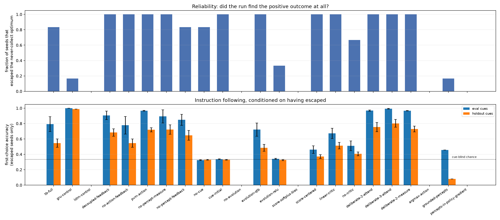
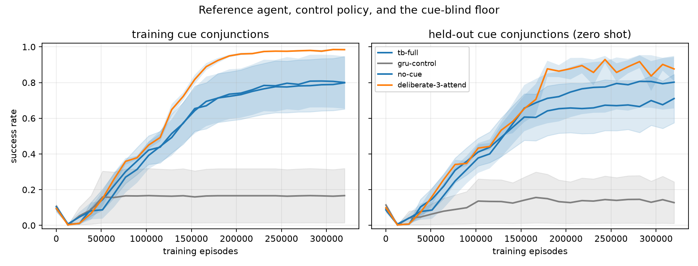
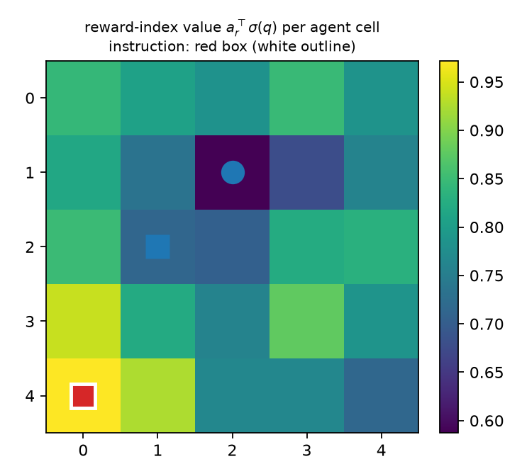
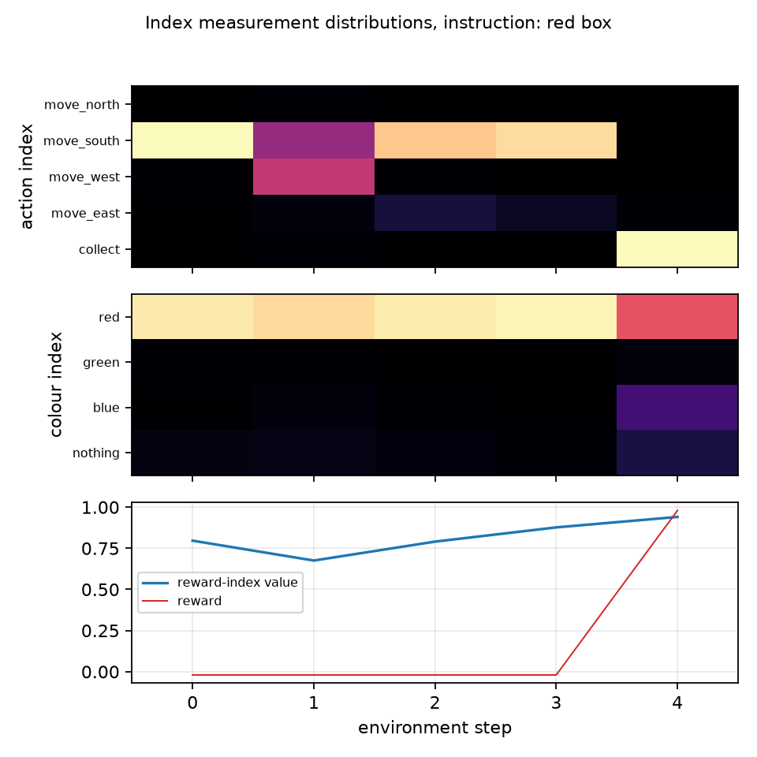
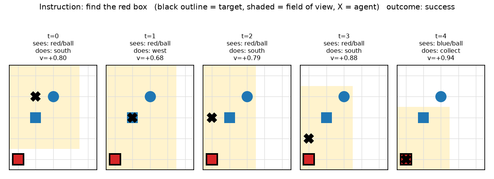
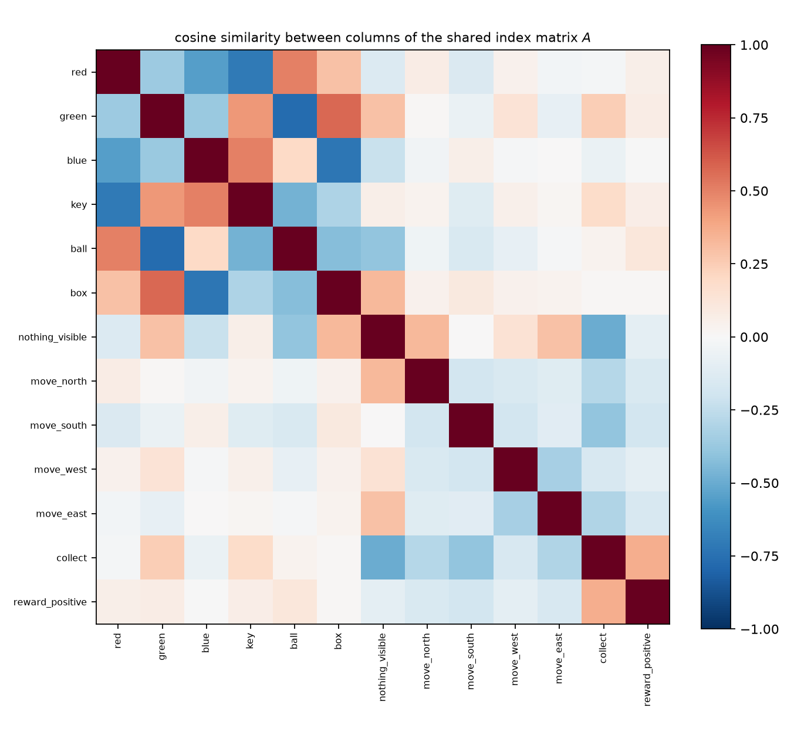
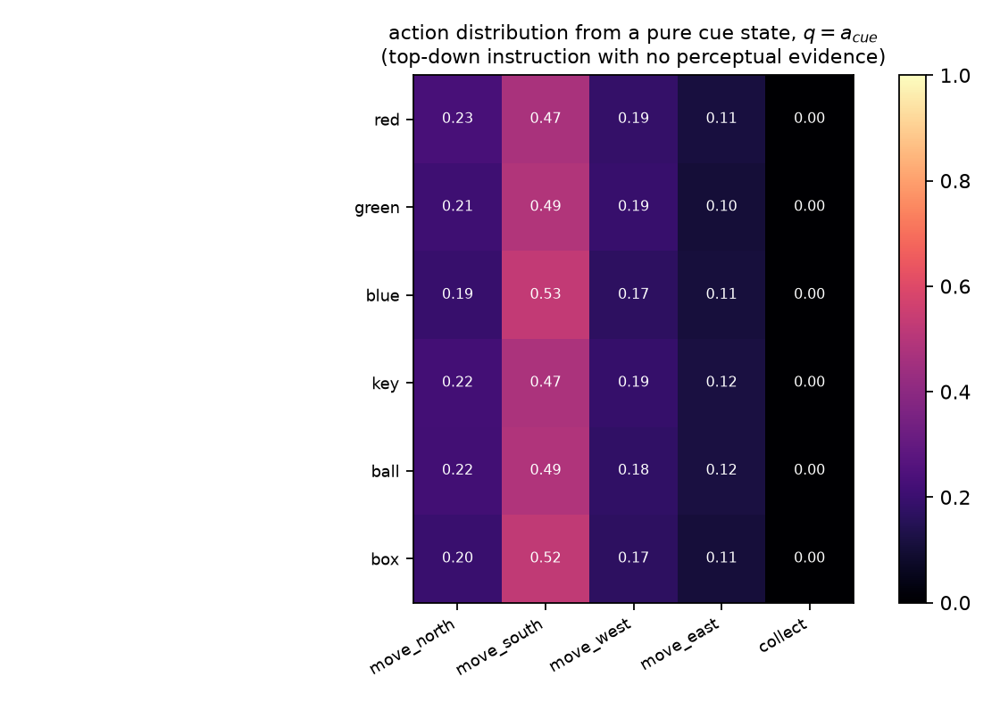

# Agency and Action Indices: Results

Lab notebook for the research line specified in [`agency_design.md`](agency_design.md). Read that
document first: it states the five claims, the environment, the concept-window schedule, and the
conditions. This one records what was run, in the order it was run, what came out, and which of
the design's assumptions did not survive contact with the data.

## Headline

Six seeds x 23 conditions x 2500 REINFORCE updates = 138 runs on a purpose-built gridworld.

**Supported.** Action indices work: the generative measurement over an action candidate group is a
usable policy (C1), reaching 0.99 first-choice accuracy and 0.80 on never-instructed cue
conjunctions in the best condition. The instruction genuinely drives behaviour — the cue-blind
control sits at exactly chance (C4). One extra column of `A` is a working internal reward function
and learns a cue-conditioned spatial value map (C5). **Deliberation depth — extra concept windows
per environment step, QTB Section 13.5.2's chain-of-thought — is the single largest effect in the
grid and costs no parameters** (C6).

**Not supported, in this environment.** The symbolic perceptual bottleneck is a net cost, and both
attempts to make its symbols mean something destroy learning (C3). Action-index feedback into the
CBS contributes nothing measurable, and the neural PVM regime beats the HB-POVM default (C2). A
decoupled feedback matrix beats the shared bidirectional `A`. The dynamic context does not retain
an instruction across an episode. One-step imagination through the evolution operator collapses.

**Not claimed.** Any comparison with conventional policies: the recipe was tuned on the Tensor
Brain agent and applied unchanged to the GRU and LSTM controls.

## 0. Reproduce

```bash
# Stage A, the capacity gate (fully observed variant)
uv run python -m experiments.agency.run_clone_gate --output runs/agency/clone_gate.json

# Stage B, the ablation grid: every condition, six seeds
for seed in 0 1 2 3 4 5; do
  for condition in $(uv run python -c \
      "from experiments.agency.conditions import CONDITIONS; print(*CONDITIONS)"); do
    uv run python -m experiments.agency.run_grid --condition "$condition" --seed "$seed" \
      --updates 2500 --output-root runs/agency/grid
  done
done

# Score every checkpoint under identical, final metric definitions
uv run python -m experiments.agency.run_reevaluate --grid-root runs/agency/grid

# Evaluation-only readouts: sampling, argmax, one-step imagination
uv run python -m experiments.agency.run_planning --grid-root runs/agency/grid

# Every figure and table in this document
uv run python -m experiments.agency.run_figures --grid-root runs/agency/grid \
  --figure-root docs/figures/agency
```

## 1. Did any of it need a change to the Tensor Brain core?

No. `src/tb` is untouched by this entire research line. That is the first result, and it is a
point in the papers' favour: if actions really are "generated as any other indices", then adding
agency should require no new operation, and it did not.

What an agent needs on top of the core turns out to be exactly the three things the papers place
*outside* it — the perceptual mapping `g(nu)`, the reward module's gated input drive, and the
coupling that lets a measured index change the world:

```python
q, action_index, probabilities = tb.measure(q, vocabulary.indices("action"))
reward, observation = environment.step(action_index)
```

Three further capabilities fall out of operations that already existed:

| Capability | Realized as | New parameters |
|---|---|---|
| Policy | the measurement distribution over the action group | none |
| Credit assignment | `log p` read from the same `measure` call, REINFORCE | none |
| Internal reward function (§13.5.2) | score of a `reward_positive` **index** | one column of `A` |
| Near-term planning (§13.5.2) | `evolve(q + a_action)` scored by that reward index | none |
| Deliberation / CoT (§13.5.2) | extra concept windows per environment step | none |

## 2. Stage A: behavioural cloning does not work as a capacity gate — and why that matters

The design proposed cloning a privileged oracle on a fully observed variant of the task as a
capacity probe, with `no-cue` as the contrast: an agent that cannot see the instruction should
clone much worse. It does not.

| condition | oracle agreement | rollout success |
|---|---|---|
| `tb-full` | 0.770 | 0.602 |
| `no-cue` | 0.768 | 0.587 |
| `no-percept-measure` | 0.807 | 0.773 |
| `deliberate-3-attend` | 0.769 | 0.448 |
| `state-128` | 0.783 | 0.655 |

Three seeds each, 1200 cloning updates, fully observed 5×5 task.

`tb-full` and `no-cue` are indistinguishable on both metrics. The reason is a property of the
objective, not of the architecture: the greedy oracle mostly moves *towards an object*, and moving
towards the wrong object agrees with it on most steps. Imitation therefore supplies almost no
gradient towards using the cue.

> **Finding 1.** In this task the instruction only becomes learnable when there is a cost to
> ignoring it. Reward, which penalizes collecting the wrong object, provides that cost; imitation
> of a competent demonstrator does not. This is a caution for any plan to bootstrap Tensor Brain
> agents from demonstrations: a demonstrator can be near-optimal and still fail to transmit *why*
> it did what it did.

Stage A is reported as a negative methodological result and is not used to initialize Stage B.

## 3. The task has a brute-force loophole, and a control found it

The design made collecting a distractor penalized but *non*-terminal, because a terminal penalty
made "never collect" an overwhelming local optimum that every architecture fell into (Section 6).
The consequence was not anticipated: an agent that knows nothing about the instruction can still
finish most episodes by collecting objects until the reward turns positive. The `no-cue` control
did exactly that, reaching 0.97 success on one seed.

> **Finding 2.** Success rate measures "did the episode end well", not "did the agent follow the
> instruction". The reported primary metric is therefore **first-choice accuracy** — was the first
> object the agent committed to the cued one — which is 1/3 for a cue-blind agent however many
> objects it collects afterwards.

This is what the `no-cue` control is for, and it is the reason it was run.

## 4. Outcomes are bimodal per seed

Runs do not vary smoothly with the seed. A run either escapes the sparse-reward local optimum in
which `collect` is suppressed and every episode times out, or it never does:

```text
tb-full  seed0  0.05 → 0.35 → 0.72 → 0.93 → 0.98 → 0.98
tb-full  seed1  0.09 → 0.38 → 0.85 → 0.95 → 0.97 → 0.98
tb-full  seed2  0.05 → 0.00 → 0.00 → 0.00 → 0.00 → 0.00
```

Trapped runs sit at exactly zero success and a return of `-max_steps × step_penalty = -0.5`.
Averaging across that bimodality reports *how many seeds escaped*, not how the architecture
behaves. Every table below is therefore split into an **escape rate** and metrics **conditional on
having escaped** (`experiments/agency/analysis.py`).

## 5. The ablation grid

| condition | escaped seeds | first choice, train cues | first choice, held-out cues | return | distractor/ep | steps |
|---|---|---|---|---|---|---|
| `tb-full` | 5 / 6 | 0.793 ± 0.097 | 0.545 ± 0.054 | +0.697 | 0.20 | 8.9 |
| `gru-control` | 1 / 6 | 0.999 ± 0.000 | 0.989 ± 0.000 | +0.896 | 0.00 | 5.2 |
| `lstm-control` | 0 / 6 | — | — | — | — | never escaped |
| `decoupled-feedback` | 6 / 6 | 0.906 ± 0.055 | 0.683 ± 0.048 | +0.790 | 0.09 | 8.1 |
| `no-action-feedback` | 6 / 6 | 0.777 ± 0.115 | 0.545 ± 0.054 | +0.712 | 0.22 | 8.6 |
| `pvm-action` | 6 / 6 | 0.967 ± 0.004 | 0.719 ± 0.026 | +0.811 | 0.03 | 7.9 |
| `no-percept-measure` | 6 / 6 | 0.893 ± 0.085 | 0.722 ± 0.061 | +0.786 | 0.11 | 7.9 |
| `no-percept-feedback` | 5 / 6 | 0.848 ± 0.072 | 0.646 ± 0.063 | +0.745 | 0.15 | 8.6 |
| `no-cue` | 5 / 6 | 0.324 ± 0.005 | 0.330 ± 0.004 | +0.480 | 0.68 | 9.7 |
| `cue-initial` | 6 / 6 | 0.337 ± 0.004 | 0.329 ± 0.006 | +0.517 | 0.66 | 9.2 |
| `no-evolution` | 0 / 6 | — | — | — | — | never escaped |
| `evolution-qtb` | 6 / 6 | 0.721 ± 0.085 | 0.484 ± 0.045 | +0.734 | 0.28 | 7.6 |
| `evolution-relu` | 2 / 6 | 0.341 ± 0.008 | 0.326 ± 0.008 | +0.572 | 0.66 | 8.0 |
| `score-softplus-bias` | 0 / 6 | — | — | — | — | never escaped |
| `score-centered` | 6 / 6 | 0.461 ± 0.050 | 0.370 ± 0.025 | +0.527 | 0.52 | 9.8 |
| `linear-critic` | 6 / 6 | 0.672 ± 0.066 | 0.513 ± 0.043 | +0.626 | 0.32 | 9.7 |
| `no-critic` | 4 / 6 | 0.511 ± 0.064 | 0.406 ± 0.025 | +0.602 | 0.49 | 9.1 |
| `deliberate-2-attend` | 6 / 6 | 0.968 ± 0.008 | 0.755 ± 0.060 | +0.740 | 0.03 | 8.9 |
| `deliberate-3-attend` | 6 / 6 | 0.992 ± 0.004 | 0.803 ± 0.050 | +0.822 | 0.01 | 8.1 |
| `deliberate-2-measure` | 6 / 6 | 0.966 ± 0.003 | 0.728 ± 0.038 | +0.812 | 0.03 | 8.1 |
| `argmax-action` | 0 / 6 | — | — | — | — | never escaped |
| `grounded-percepts` | 1 / 6 | 0.456 ± 0.000 | 0.080 ± 0.000 | -0.362 | 0.23 | 22.5 |
| `percepts-in-policy-gradient` | 0 / 6 | — | — | — | — | never escaped |






Six seeds per condition, 2500 REINFORCE updates (320k episodes) each, 138 runs in total.
Each condition differs from `tb-full` in exactly one respect. **First-choice accuracy is 1/3 for
a cue-blind agent**, and `no-cue` lands at 0.324 / 0.330 — the metric behaves exactly as designed.

### C1 — actions are ordinary indices ✅

A generative measurement over an action candidate group is a working policy: `tb-full` escapes on
5/6 seeds and reaches 0.793 first-choice accuracy on training cues and 0.545 on cue conjunctions
it was never instructed with. `deliberate-3-attend` reaches 0.992 / 0.803. The Tensor Brain agent
is also markedly *more reliable* than the controls under this recipe (5–6/6 versus 1/6 for the GRU
and 0/6 for the LSTM) — but the recipe was tuned on the Tensor Brain agent, so this is reported as
a reliability observation, not as evidence of superiority. Note that on the one seed where the GRU
did escape it reached 0.999 / 0.989, better than any Tensor Brain condition.

### C6 — deliberation depth is the largest single effect ✅

This was not in the original design; it was forced by a diagnostic. Within one concept window the
map from input to index scores passes exactly one nonlinearity, so a one-window agent is a
perceptron over `sigma(q)` and all depth must come from the evolution operator — the same argument
the repository's XOR diagnostic already makes. Running extra internal concept windows per
environment step, which is QTB Section 13.5.2's chain-of-thought reading of near-term planning,
is the biggest improvement in the grid:

| windows | first choice, train | first choice, held out | distractor/ep |
|---|---|---|---|
| 1 (`tb-full`) | 0.793 | 0.545 | 0.20 |
| 2 (`deliberate-2-attend`) | 0.968 | 0.755 | 0.03 |
| 3 (`deliberate-3-attend`) | **0.992** | **0.803** | **0.01** |

It costs no parameters. Deterministic `attend` feedback and sampled `measure` feedback between
windows perform comparably (0.968 versus 0.966 at two windows), so the benefit comes from the
repeated evolution rather than from the discreteness of the intervening index.

### C4 — instruction indices work, but the dynamic context does not hold them ✅ / ❌

`no-cue` sits at chance (0.324 / 0.330) while cued agents are far above it, so the top-down index
injection genuinely drives behaviour, and held-out cue conjunctions transfer well above chance.

But `cue-initial`, which injects the instruction only at `t = 0`, is **also at chance**
(0.337 / 0.329) despite escaping on 6/6 seeds and reaching high *success*. It solves episodes by
brute force instead. The recurrent dynamic context does not retain a symbolic instruction across
an episode here. That is a clean negative and the single most concrete target for follow-up work.

### C5 — the internal reward function can be an index ✅

| critic | escaped | first choice, train |
|---|---|---|
| `reward_positive` index (`tb-full`) | 5/6 | 0.793 |
| `nn.Linear` head (`linear-critic`) | 6/6 | 0.672 |
| none (`no-critic`) | 4/6 | 0.511 |

One extra column of `A` is at least as good a critic as a separate linear head, and a critic
clearly matters. The qualitative evidence is stronger than the table: the reward index's score
evaluated across a frozen layout is a cue-conditioned spatial value function that peaks on the
instructed object and actively *devalues* the distractors.



### C3 — the symbolic perceptual bottleneck is a net cost here ❌

`no-percept-measure` (0.893) beats `tb-full` (0.793). Worse, the two attempts to make the symbols
*mean* something both destroy learning: an auxiliary grounding loss escapes on 1/6 seeds, and
including the perceptual log-probabilities in the policy gradient escapes on 0/6.

The reason is visible in the rasters: under reward alone the perceptual measurement collapses onto
the **instruction**. The agent names what it is looking for, not what it sees — the colour index
stays pinned to the cue for the whole episode.



> **Finding 3.** Nothing in a reward objective requires a symbol to be true. Left alone, the
> serial naming bottleneck becomes a second copy of the goal; forced to be accurate, it competes
> with the policy for the shared representation and learning fails. Making the Tensor Brain's
> symbolic bottleneck earn its place needs a task in which naming things correctly *pays*, which
> the gridworld does not provide. This is a strong argument for the BabyAI step.

### C2 — action feedback: no benefit, and the PVM regime is better ❌

`no-action-feedback` (0.777) is indistinguishable from `tb-full` (0.793). More interestingly,
`pvm-action` — the neural PVM regime `alpha = 0`, in which the action window *discards* the
accumulated pre-CBS and keeps only the action embedding — reaches 0.967 / 0.719, well above the
HB-POVM default. On this task the order effect helps.

### The shared bidirectional matrix ❌ (in this setting)

`decoupled-feedback`, in which scoring keeps `A` while measurement injects an independently
trained second matrix, escapes 6/6 and reaches 0.906 / 0.683 against `tb-full`'s 5/6 and
0.793 / 0.545. Sharing one matrix for scoring and feedback is not what makes this work. The task
has no naming, language, or memory read-out that would reward a shared symbol space, so this is
evidence about *this task*, not a refutation — but it is the honest reading of the grid, and it is
why the claim needs an environment where the same symbols are used in more than one role.

### Evolution and scoring

- `no-evolution` never escapes (0/6). The evolution operator is required, as expected from the
  one-nonlinearity argument.
- `evolution-qtb` (feed-forward, no persistent context) escapes 6/6 and reaches 0.721 / 0.484 —
  close to the original recurrence, further evidence that the dynamic context is not carrying much
  in this task.
- `evolution-relu` escapes only 2/6 and then sits at chance. The ReLU variant is much less
  reliable than the sigmoid ones.
- `score-softplus-bias` **never escapes (0/6)**, while `direct` and `centered` do. The QTB
  factorized-Bernoulli normalizer `a0_k = -sum_l softplus(a_lk)` produces a large negative,
  norm-dependent offset that appears to prevent the action softmax from ever moving. This is
  flagged for review: it is a paper-derived score mode failing completely on a task the other
  modes solve.
- `argmax-action` never escapes (0/6). Winner-take-all *during training* leaves REINFORCE without
  a valid gradient estimator, so this confirms that the generative sampling QTB Section 12.1.2
  argues for is what makes the index layer trainable by this rule — with the caveat that the
  estimator, not the architecture, is what breaks.

### C6 — one-step imagination as an action readout ❌

Re-reading trained checkpoints under three action-selection rules, with no retraining:

| readout | `tb-full` train / held out | `deliberate-3-attend` train / held out |
|---|---|---|
| `sample` (as trained) | 0.796 / 0.706 | 0.986 / 0.858 |
| `argmax` | 0.787 / 0.705 | 0.947 / 0.805 |
| `planned` (imagine each action, score with the reward index) | 0.041 / 0.034 | 0.040 / 0.021 |

Planning collapses. The evolution operator was only ever trained to carry state forward under the
action the agent actually took, so `evolve(q + a_action)` for a *counterfactual* action is far
off-distribution and the reward index's score of it is meaningless.

> **Finding 4.** QTB Section 13.5.2 treats the evolution operator as something that can be
> unrolled to imagine futures. It is not a world model unless it is trained as one. Model-predictive
> use of the Tensor Brain needs an explicit predictive objective — an obvious and well-posed next
> experiment, since the machinery is already in place.

### Qualitative behaviour

The reference agent, instructed "find the red box", walking past two distractors and collecting
the target, with its own sampled symbols and its reward-index value printed above each step:



The shared index matrix organizes itself into near-orthogonal perceptual and action subspaces,
with `reward_positive` aligned to `collect`:



Cue embeddings on their own produce almost identical action distributions, with `collect` strongly
suppressed. The instruction is not a stored motor program; it only selects behaviour in
conjunction with perceptual evidence:




## 6. What was tried and abandoned

Recorded because the failures constrain the design as much as the successes.

1. **Terminal distractor penalty.** The original design ended the episode on any collection, with
   `-1` for a distractor. Every condition, including the GRU control, collapsed to never pressing
   `collect`: early in learning the action is negative in expectation, it is suppressed, and the
   positive outcome is then never experienced. Made non-terminal (Section 3).
2. **A larger, conjunction-heavy observation.** A fully observed 9×9 egocentric view made
   behavioural cloning plateau near 0.73 agreement. Within one concept window the map from input
   to index scores passes exactly one nonlinearity, so binding "colour AND shape AND position"
   across 81 cells needs roughly one hidden unit per cell. Reduced to a 5×5 view, where the
   discrimination that matters happens on the cell the agent occupies.
3. **Learning rate `1e-3`.** Collapsed to the never-collect optimum in every condition tried. A
   trivial one-object control task confirmed the pipeline was correct and that `3e-3` was the
   difference. Recorded because it means the recipe was tuned on the Tensor Brain agent and then
   applied unchanged to the controls, which biases the comparison in the Tensor Brain's favour.
4. **Behavioural-cloning initialization of REINFORCE.** Improved the starting point but degraded
   under policy gradient, because the cloned policy collected distractors ~68% of the time and the
   fastest way to stop losing reward was to stop collecting.

## 7. What is not claimed

- **No claim that the Tensor Brain outperforms a conventional recurrent policy.** The recipe was
  tuned on it; the GRU and LSTM controls inherit it untuned. Within-grid ablation contrasts are
  the defensible readings.
- **No claim about sample efficiency.** REINFORCE with a value baseline is a weak algorithm and
  every condition carries that handicap equally.
- **No claim that this generalizes beyond one purpose-built gridworld** with a hand-made 14-index
  vocabulary designed by the same process that designed the agent. That circularity is precisely
  why [`agency_design.md`](agency_design.md) §3.3 commits to BabyAI/MiniGrid next: published
  compositional-generalization splits and published baselines make the C4 result checkable by
  someone else.
- **No claim of biological plausibility** for the credit-assignment rule.

## 8. Where this goes next

Ordered by what the results actually justify.

1. **BabyAI / MiniGrid**, as committed in the design document. Three of this grid's findings are
   specifically bottlenecked on the toy task: the perceptual bottleneck has nothing to earn
   (Finding 3), the shared bidirectional matrix has only one role to play, and the compositional
   generalization result needs published splits and published baselines to be checkable by anyone
   else. This is the highest-value next step and the code boundary is already right — only
   `gridworld.py` and `vocabulary.py` would be replaced.
2. **Give the evolution operator a predictive objective**, then re-run the `planned` readout.
   Finding 4 is a well-posed negative with an obvious experiment attached: add a next-CBS or
   next-observation prediction loss and ask whether imagination becomes usable. This is the
   cheapest high-information follow-up and needs no new environment.
3. **Investigate why `score-softplus-bias` never escapes.** A paper-derived score mode failing
   completely where `direct` and `centered` succeed is either a real property of the normalizer
   under a policy-gradient objective or a scale problem that a temperature would fix. It affects
   how that mode should be described in `docs/fidelity.md`, so it deserves review rather than a
   silent workaround.
4. **Make the instruction survive the episode.** `cue-initial` at chance is the clearest capability
   gap: it is exactly the "recent episodic memory provides state information" claim of
   QTB Section 13.4.1, and it currently fails. Candidate interventions, in the repository's
   existing vocabulary: xLSTM or Mamba behind the evolution boundary, or an explicit episodic index
   written at `t = 0` and re-read.
5. **A fair comparison, if a comparative claim is ever wanted.** Equal hyperparameter budget given
   to the Tensor Brain and to the GRU/LSTM controls, and a stronger algorithm than REINFORCE. The
   present grid deliberately does not support such a claim.


## 9. Artifacts

- `docs/figures/agency/` — every figure, plus `escape_table.md` and `summary.json`.
- `runs/agency/grid/<condition>/seed<k>/` — `config.json`, `result.json` (full learning curves),
  and `checkpoint.pt` for each of the 138 runs. Not committed; regenerate with the commands above.
- `runs/agency/reevaluation.json`, `runs/agency/planning_*.json`, `runs/agency/clone_gate.json`.
