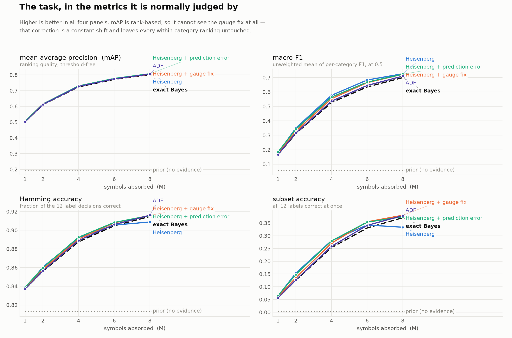
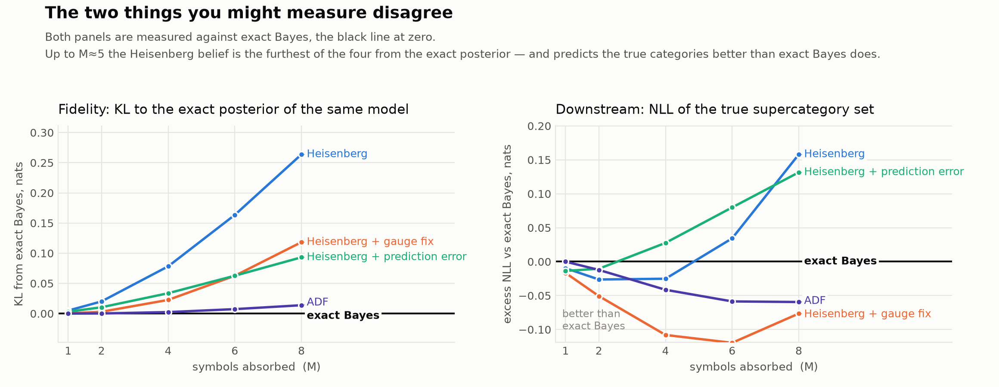
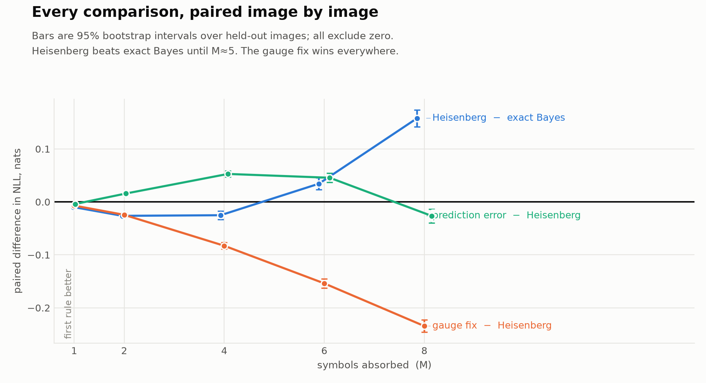
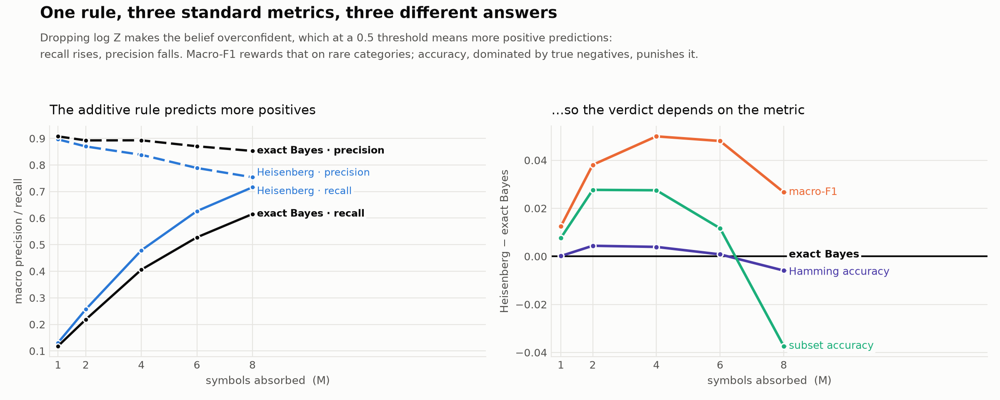
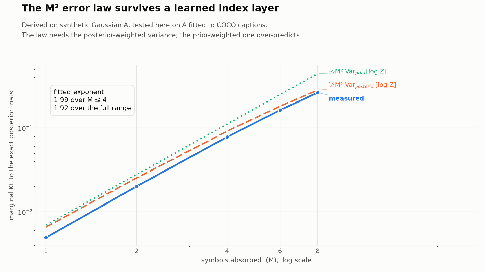
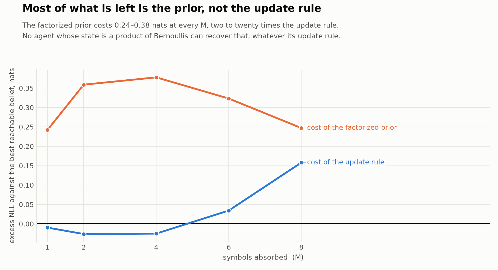
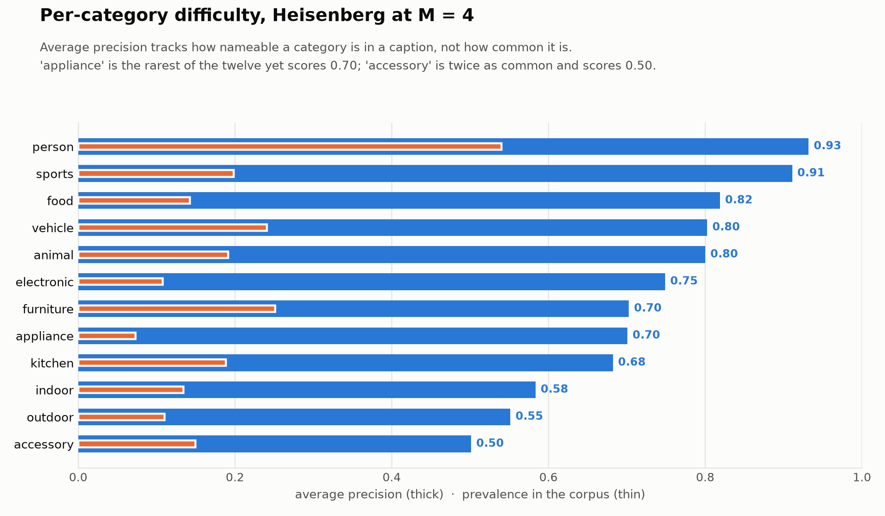

# The Heisenberg update with a learned index layer, on MS-COCO

The first test of the additive update `q ← q + a_k` where the index matrix `A` is
**fitted to real data** rather than sampled, and where the question is **what the
belief is good for**, not only how close it sits to the exact posterior.

Everything in the thesis so far evaluates the update on synthetic i.i.d. Gaussian
`A`, with the inference model exactly matching the data generator. That design
answers "is the additive rule a good approximation?" It cannot answer "does the
approximation error matter for a decision?", because there is no decision, and it
cannot answer "does the theory survive a trained layer?", because nothing is
trained. This experiment answers both.

---

## 1. The dataset

**MS-COCO 2017** (Lin et al., 2014), the standard object-recognition and
captioning corpus. Only the annotation files are used — **no images, no feature
extraction, no GPU**.

| | |
|---|---|
| Download | `annotations_trainval2017.zip`, ~241 MB, from `cocodataset.org` |
| License | annotations CC BY 4.0 (COCO Consortium) |
| Images | 118,287 in `train2017` |
| Instance annotations | ~860k object instances over **80 categories**, grouped into **12 supercategories** |
| Caption annotations | **5 independent human captions per image** |

The property that makes COCO the right choice is that it carries **two
independent annotation passes over the same images**:

- **the instance channel** — trained annotators segmented every object of the 80
  categories, exhaustively by protocol;
- **the caption channel** — separate crowd workers wrote five free-form sentences
  describing each image, mentioning only what struck them as worth saying.

This experiment uses the instance channel to define the **latent** and the caption
channel to supply the **evidence**. Because they are different annotation
processes, the latent is a genuine ground truth rather than a relabelling of the
evidence — which is precisely the trap that disqualifies the more obvious designs
(see §3.3).

---

## 2. The task

An agent is told, one word at a time, what a person said about a photograph. From
those words alone it must infer **which kinds of thing the photograph actually
contains**.

```
latent   x ∈ {0,1}^12    which COCO supercategories are present in the image
index    k ∈ 1..1000     a content word drawn from the human captions
update   q ← q + a_k     one vector addition per word revealed
belief   γ = σ(q)        probability that each supercategory is present
```

A worked example from the corpus:

```
revealed words : street · parked · car · couple · city · bench · sidewalk · parking · busy
true latent x  : person, vehicle, outdoor
```

Nobody said "person" or "vehicle". The agent has to get there from *couple*,
*car*, *parked* and *sidewalk*, which is exactly the inference the index layer has
to learn — and exactly why `A` is non-trivial.

The 12 supercategories are `person, vehicle, outdoor, animal, accessory, sports,
kitchen, food, furniture, electronic, appliance, indoor`.

**Why `n = 12` matters.** Twelve binary latents means `2^12 = 4096` configurations,
so the **exact Bayesian posterior is computable by enumeration** — a 4096×12
matmul. That is what makes the whole comparison possible: every approximate rule
can be scored against the true posterior of the same model rather than against
another approximation.

---

## 3. Building the corpus

### 3.1 The latent

For each image, `x_i = 1` if any non-crowd instance annotation belongs to
supercategory `i`. Images with no instance annotations are dropped: their latent
is *undefined*, not empty — COCO does not annotate objects outside the 80
categories, so an image of a forest has an empty vector for reasons that have
nothing to do with the caption.

### 3.2 The symbols

The five captions are concatenated, lowercased, split on non-alphabetic
characters, and filtered:

1. tokens of ≤ 2 characters are dropped;
2. a 139-word stopword list is removed (`the`, `is`, `with`, `several`, …);
3. plurals are folded onto their singular when the singular is at least as
   frequent (`dogs` → `dog`), a crude stand-in for a lemmatizer;
4. the vocabulary is the **top `K = 1000`** surviving words by corpus frequency;
5. per image the symbols are **deduplicated** — the evidence is a *set*.

Deduplication is a deliberate modelling choice. Keeping multiplicities would make
the redundant-evidence regime the default, which the analysis already shows
punishes the additive rule hardest; a set also matches the order-invariance
framing, since there is no canonical order in which a scene gets described.

Resulting corpus: **117,266 images**, mean **14.1 symbols per image** (median 14,
p10 10, p90 18), mean **2.32 supercategories present**. The most frequent symbols
are `man, sitting, standing, people, white, woman, street, table, holding`; the
1000th is around the frequency of `spread` and `stadium`.

### 3.3 The degeneracy trap, and why PVSG was rejected

If `x` is a deterministic function of `k`, the experiment is void: `A` collapses to
an indicator matrix and *every* inference rule is trivially near-perfect, so no
comparison between them means anything.

This disqualifies the obvious designs. Using COCO **instance labels** as symbols
fails, because an instance's supercategory is a lookup. The in-repo **PVSG**
pipeline fails for the same reason — its reviewed hierarchy maps each fine label
to its coarse parent deterministically. Instacart (product → department) fails
too. Caption words escape the trap because `couple → person` is a genuine
statistical inference, not a lookup.

### 3.4 Splits

A deterministic image-disjoint split, seed 0: **93,813 train / 23,453 held out**
(80/20). The index layer is fitted on train only; every number reported below is
on held-out images.

---

## 4. The model

The likelihood is the paper's own emission model, unchanged:

```
P(k | x) = softmax(a0 + Aᵀx)_k ,      A ∈ R^{12×1000},  a0 ∈ R^1000
```

The prior is fitted separately, in **two forms**, because the scoping work showed
prior misspecification and update-rule error are confounded and must be reported
apart:

- **factorized** — independent Bernoulli marginals, `q_prior = logit(mean presence
  rate)`. This is what the theory assumes and what any product-of-Bernoullis agent
  can hold.
- **empirical joint** — the full Laplace-smoothed distribution over all 4096
  presence patterns. Not reachable by a factorized state; included purely as a
  ceiling.

---

## 5. Training

### 5.1 The objective

Fitting `(A, a0)` by maximum likelihood of the emission model **is multinomial
logistic regression** of the named word on the presence vector:

```
loss(A, a0) = − (1/N) Σ_{(x,k)} log softmax(a0 + Aᵀx)_k  +  λ‖A‖²
```

with `N ≈ 1.65 M` (image, word) pairs. Nothing about the *update rule* enters
training. `A` is fitted to the data, and every inference rule is then scored
against the same learned model — which is what keeps the comparison a statement
about the update rule rather than about model quality.

### 5.2 Sufficient statistics make it cheap

`x` takes only `2^12` values, so the objective depends on the corpus **only**
through the `[4096, 1000]` table `N[x, k]` counting how often word `k` was used
for presence pattern `x`. Written that way,

```
loss = Σ_x [ N[x,·].sum() · logZ(x) − Σ_k N[x,k]·s_k(x) ] / N
```

which is exact — not a subsample — and roughly two orders of magnitude cheaper
than iterating over the 1.65 M pairs. `model.sufficient_statistics` builds it.

### 5.3 Settings

| | |
|---|---|
| optimizer | Adam, full-batch on the statistic table |
| learning rate | 0.2 |
| steps | 800 |
| weight decay | `1e-4` on `A` (`a0` unpenalized) |
| initialization | `A = 0`, `a0 = 0` |
| precision | float64 throughout |
| wall clock | **14 s on CPU** |

### 5.4 Did it learn anything?

Held-out symbol NLL **5.639** against **6.908** for a uniform vocabulary — the
index layer carries **1.27 nats** about which word a caption will use. Mean column
norm `‖a_k‖ = 1.04`. So `A` is doing real work and has not collapsed to an
indicator matrix.

The diagnostic that drives the theory: **`Var[log Z] = 0.0139`**, with an **affine
fraction of 0.690** — that is, 69% of the variation in the log-partition is
explained by a linear function of `x`, and therefore removable for free (§7.2).

---

## 6. Metrics

Two families, reported in this order.

### 6.1 Multi-label classification metrics — the decision

The task is multi-label recognition over 12 labels, so the standard metrics apply.
All are computed against the true presence vector on held-out images.

| metric | definition | notes |
|---|---|---|
| **mAP** | mean over the 12 categories of average precision, using `γ_i` as the score | threshold-free, rank-based; the usual headline for multi-label recognition |
| **macro-F1** | unweighted mean of per-category F1 at threshold 0.5 | weights rare categories equally with common ones |
| **micro-F1** | F1 pooling all 12 × N decisions before dividing | dominated by frequent categories |
| **Hamming accuracy** | fraction of the 12 label decisions correct (= 1 − Hamming loss) | dominated by true negatives |
| **subset accuracy** | fraction of images with all 12 labels correct at once | the strictest, and the one a downstream consumer of the whole vector feels |
| **ECE** | expected calibration error, 12 equal-width bins | are the stated probabilities honest? |
| macro precision / recall | per-category, averaged | used to explain *why* the metrics disagree |

`NLL` (Bernoulli negative log likelihood of the true vector, summed over the 12
bits, in nats) is also reported. It is not a standard classification metric, but it
is the one that scores the *whole belief* rather than a thresholded decision, and
it is the metric the paired statistics are computed on.

### 6.2 Fidelity metrics — the diagnostic

| metric | definition |
|---|---|
| **joint KL** | `KL(P ‖ Q)` over all 4096 states, `P` the exact posterior of the same learned model |
| **marginal KL** | `Σ_i KL(P_i ‖ Q_i)` — the pure update-rule error |

These decompose exactly: `joint KL = (factorization error) + (marginal KL)`, so
`exact` has marginal KL identically zero and a non-zero joint KL equal to the
irreducible cost of holding a product belief.

**One reading trap.** Fidelity is measured against the exact posterior *of the
assumed factorized-prior model*. `exact-empirical-prior` deliberately uses a
different, better model, so its large "fidelity" number is not a defect — it is
distance from a model now known to be wrong. That row is the best predictor in
every table and the furthest from "exact", which is itself the cleanest possible
illustration of §7.1.

### 6.3 Paired statistics

Every rule sees identical evidence on identical images in identical order, so the
comparison is **paired** and the per-image difference is the unit of analysis. All
contrasts are reported as bootstrap 95% intervals over held-out images (2000
resamples). This is not optional: the effect sizes are a few hundredths of a nat
against ~3 nats of absolute NLL, and unpaired means cannot separate the rules.

---

## 7. Results

117,266 images, `n = 12`, `K = 1000`, 6,000 evaluation images per point, `M`
swept over 1, 2, 4, 6, 8. Every rule agrees with the reference implementation in
`experiments.bayes_approximation` to **≤ 2.2e-15**.

**In one sentence: with a genuinely learned index layer the Heisenberg update is
an excellent approximation, and — up to a measurable amount of evidence — a
better decision rule than the exact Bayesian posterior it approximates.**

### 7.0 The task, in the metrics it is normally judged by



Absorbing 8 caption words takes mAP from **0.195** (prior, no evidence) to
**0.804**, macro-F1 from 0.059 to 0.726, Hamming accuracy from 0.813 to 0.916,
and subset accuracy from 0.002 to 0.380. So the task is learnable and non-trivial,
and all rules land close together — which is the setting in which the differences
below are worth taking seriously.

Note what mAP cannot see: **Heisenberg and Heisenberg + gauge fix have identical
mAP to five decimals at every `M`**. The gauge fix subtracts a fixed vector, so it
shifts every image's score for a given category by the same amount and leaves
within-category ranking untouched. A rank-based metric is blind to it *by
construction*. It changes calibration, not ordering.

### 7.1 Fidelity and downstream quality disagree



At `M = 4` the Heisenberg belief is the **furthest of the four rules** from the
exact posterior (marginal KL 0.078, against ADF's 0.002) and **simultaneously
predicts the true supercategories better than exact Bayes**: −0.025 nats NLL,
95% CI [−0.033, −0.017]. By `M = 6` that reverses; at `M = 8` exact Bayes leads by
0.158 nats.



So "is the additive rule good enough?" has no single-number answer. It has a
**budget**: better than exact inference below roughly five absorbed symbols, worse
above. Because the `M²` law sets that boundary, the boundary is predictable rather
than merely observed.

*Mechanism (a hypothesis — this experiment does not isolate it).* Two
misspecifications partly cancel. The factorized prior misses the strong positive
correlations between supercategories (`kitchen`+`food`+`appliance`), which makes
exact Bayes under it *under*-confident about co-occurring categories; dropping
`log Z` makes the additive rule *over*-confident. The `exact-empirical-prior` row
supports this: given the correct joint prior, NLL falls sharply at every `M`.

### 7.2 …and the standard metrics disagree with each other



This is the sharpest practical finding, and it is invisible if only one metric is
reported. Dropping `log Z` makes the belief overconfident; at a 0.5 threshold that
means **more positive predictions**. Macro recall rises (0.716 vs exact's 0.616 at
`M = 8`) and macro precision falls (0.754 vs 0.853).

The consequence is that the same rule wins or loses depending on the metric:

| metric at `M = 8` | Heisenberg | exact Bayes | verdict |
|---|---|---|---|
| macro-F1 | **0.726** | 0.699 | Heisenberg better at **every** M |
| mAP | **0.8038** | 0.8012 | essentially tied |
| Hamming accuracy | 0.9088 | **0.9147** | crosses over near M ≈ 6 |
| subset accuracy | 0.333 | **0.371** | crosses over near M ≈ 6 |
| NLL | 2.952 | **2.794** | crosses over near M ≈ 5 |

Macro-F1 rewards recall on rare categories, which is exactly what overconfidence
buys. Hamming and subset accuracy are dominated by the many true negatives, which
is exactly what it costs. **A chapter that reported only macro-F1 would conclude
the additive rule beats exact inference outright; one that reported only subset
accuracy would conclude the opposite.** Both would be wrong.

### 7.3 The gauge fix is free and wins on every threshold metric

`q ← q + a_k − c`, with `c` the least-squares slope of `log Z` under the prior, is
`O(n)`, exactly order-invariant, and a **re-normalization of trained weights**
rather than a change to the inference loop. It improves NLL at every `M` — −0.007,
−0.024, −0.083, −0.154, **−0.235** nats — on 68–76% of individual images, and cuts
ECE at `M = 8` from **0.060 to 0.021**. It also lifts subset accuracy at `M = 8`
from 0.333 to 0.380.

It is invisible to mAP, for the reason in §7.0.

Chapter 4 of the thesis derives this correction (~line 1054) and never implements
it. This is its first measurement, and the clearest practical recommendation the
experiment yields: **always gauge-fix a trained index layer.**

### 7.4 The `M²` error law survives a learned layer



The law was derived and tested on synthetic i.i.d. Gaussian `A`. On `A` fitted to
COCO captions the measured exponent is **1.99 over `M ≤ 4`** and 1.92 over the
full range — the shape transfers intact.

The coefficient needs care. The law is `KL ≈ ½M²·Var_{P(·|k)}[log Z]`, weighted by
the **posterior**. Using the prior-weighted variance over-predicts by 29% at
`M = 1` and 41% at `M = 8`; the posterior-weighted variance gives ratios of 0.75 at
`M = 1` rising to **0.94 at `M = 8`**. The posterior concentrates as evidence
accumulates, so the prior-weighted variance drifts further wrong exactly where the
error is largest.

### 7.5 Most of what is left is the prior, not the update rule



Splitting the gap to the best belief reachable with the correct joint prior: the
update rule costs between −0.03 and +0.16 nats; the **factorized prior costs
0.24–0.38 nats at every `M`**, two to twenty times more. No agent whose state is a
product of Bernoullis can recover that, whatever its update rule.

The `O(nK)` prediction-error correction demonstrates the point directly: it
improves fidelity but *hurts* NLL at `M = 2, 4, 6`, and is beaten at every `M` by
the free `O(n)` gauge fix.

### 7.6 What the task itself looks like



Per-category average precision tracks **nameability**, not prevalence. `appliance`
is the rarest of the twelve (7.3% of evaluated images) and scores 0.70;
`accessory` is twice as common (15.0%) and scores 0.50, because handbags and ties
are present in photographs far more often than they are mentioned in sentences
about them. `person` (54.0%) and `sports` score highest at 0.93 and 0.91.

This is the caption channel's selection effect showing up directly in the metrics
— and it is the reason the gated-vs-exhaustive contrast in §9 is worth running.

---

## 8. Rules compared

| rule | update | cost |
|---|---|---|
| `prior` | ignores the evidence | — |
| `heisenberg` | `q ← q + a_k` | `O(n)` |
| `heisenberg-gauge` | `q ← q + a_k − c` | `O(n)` |
| `heisenberg-pe` | `q ← q + A(e_k − p)`, `p = softmax(a0 + Aᵀγ)` | `O(nK)` |
| `adf` | exact update, then project back to a product | `O(2ⁿK)` |
| `exact` | exact posterior, factorized prior | `O(2ⁿK)` |
| `exact-empirical-prior` | exact posterior, full empirical joint prior | `O(2ⁿK)` |

`exact-empirical-prior` is deliberately **not** achievable by any agent whose state
is a product of Bernoullis. It separates "the update rule is wrong" from "the
factorized prior is wrong".

---

## 9. What this does not show

- **The measurement process is untested.** Only the caption channel is used, so
  the gated-versus-exhaustive contrast — the one that would test the
  saliency-gating claim on real data, and with it the τ estimate — is still open.
  It is the highest-value remaining arm.
- **`A` is fitted once.** The sweep varies evaluation images, not fit seeds.
- **The captions are not conditionally independent given `x`.** A caption
  mentioning `pizza` is likelier to also mention `plate`. Every rule inherits that
  misspecification equally, so the comparison between rules stays fair, but no
  rule's absolute NLL should be read as well specified.
- **No non-TB baseline.** A capacity-matched DeepSets/MLP over the same symbol set
  would answer whether the probabilistic machinery earns its place at all.
- **Class imbalance is real** — `person` 54%, `appliance` 6.5% — which is why
  macro and micro averages are both reported.
- The tokenizer is a stopword list plus a crude plural fold, not a lemmatizer.
  Deliberate: no NLP dependency, and the mapping is inspectable.

---

## 10. Running it

```sh
# once: annotations only, no images, no GPU (~241 MB)
mkdir -p data/coco && cd data/coco
curl -O http://images.cocodataset.org/annotations/annotations_trainval2017.zip
unzip -q annotations_trainval2017.zip && cd -

# build the corpus (~8 s)
PYTHONPATH=".:src" uv run --extra coco python -c "
from pathlib import Path
from experiments.coco_heisenberg import data as D
c = D.build_corpus(Path('data/coco/annotations'), split='train2017', vocabulary_size=1000)
D.save(c, Path('data/coco/corpus_train2017_k1000.npz'))"

# fit and evaluate (~90 s on a laptop)
TB_BAYES_ROOT=../tensor-brain-bayes-approximation PYTHONPATH=".:src" \
  uv run --extra coco python -m experiments.coco_heisenberg.run_experiment \
    --corpus data/coco/corpus_train2017_k1000.npz --symbol-counts 1 2 4 6 8

# figures
PYTHONPATH=".:src" uv run --extra coco python -m experiments.coco_heisenberg.figures
```

`TB_BAYES_ROOT` is needed only for the cross-check against the reference rules in
the `bayes-approximation` worktree. Both worktrees ship a top-level `experiments`
package, so `load_reference` binds the analysis package under its own name rather
than relying on `PYTHONPATH` order.

## 11. Layout

| file | what it does |
|---|---|
| `data.py` | builds `(presence, symbols)` records from the two annotation channels; dependency-free tokenizer |
| `model.py` | maximum-likelihood fit of `(A, a0)` via sufficient statistics; the two priors |
| `evaluation.py` | the update rules, classification and fidelity metrics, paired bootstrap |
| `run_experiment.py` | CLI; sweeps `M`, writes `results.json` |
| `figures.py` | the seven figures |

Tests are in `tests/test_coco_heisenberg.py` (10, no COCO download needed; the
reference cross-check is skipped unless `TB_BAYES_ROOT` is set).
