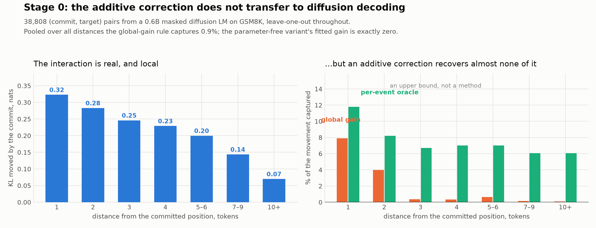

# Stage 0: is the Heisenberg update useful for diffusion decoding?

A kill-switch measurement, run before anything is built.

## The idea being tested

Masked diffusion language models generate by unmasking several positions per
forward pass. The obstacle is *joint inconsistency*: tokens chosen independently
from their marginals form incompatible configurations — the standard example is
"New City" instead of "New York". The current state of the art
([Zoabi, Ali, Ringel & Wolf, arXiv:2606.15805](https://arxiv.org/abs/2606.15805))
handles this by choosing *which* positions are safe to commit together, then
committing and paying for a fresh forward pass.

What it never does — verified in the paper's text — is **update the still-masked
positions to account for what was just committed**. Its pairwise interaction
matrix is also built from marginals alone, which the authors concede "does not
explicitly model higher-order structure or recover the true joint conditional
distribution."

That gap is exactly the shape of the Heisenberg update. The exact correction to a
remaining position is a pointwise mutual information vector,

```
log P(x_j = v | ctx, x_i = k)  =  log P(x_j = v | ctx)  +  PMI(x_j = v ; x_i = k)
```

and approximating it by a vector that depends only on the committed token,

```
logits_j  ←  logits_j + a_k        for every still-masked j
```

**is** `q ← q + a_k`, with `q` the logit vector at a masked position. If that
approximation holds, tokens can be committed *and corrected* inside a single
forward pass, which is a throughput win the incumbent cannot get.

The assumption is strong: it says the effect of committing a token is the same
regardless of context, and language dependence is famously contextual. So the
first thing to do is measure it, cheaply, on a small model.

## What stage 0 measures

Per commit event:

1. run the model on a partially decoded sequence → `log π_j` for masked `j`;
2. commit the argmax token `k` at the most confident **content** position `i`;
3. run the model again → `log π'_j`;
4. the ground truth correction is `Δ_j = log π'_j − log π_j`.

The question is what fraction of that correction an additive, state-independent
rule recovers:

```
captured  =  1 − KL(π'_j ‖ softmax(log π_j + â_k)) / KL(π'_j ‖ log π_j)
```

The denominator is what current decoders lose by doing nothing within a pass.
`captured = 0` means the additive rule is worthless; `captured = 1` means it
reproduces a forward pass for free.

### Rules compared

| rule | correction | fitted from |
|---|---|---|
| do nothing | `0` | — the current behaviour within a pass |
| additive, gain 1 | `â_k` | mean `Δ` over other contexts where `k` was committed |
| additive, global gain | `β·â_k` | plus one scalar `β` shared by every event |
| free | `λ·E Eᵀ e_k` | no fitting at all beyond one scalar `λ` |
| oracle gain | `β*·â_k` | `β*` chosen per event — an upper bound, not a method |

The **free** variant needs no new parameters: with tied embeddings the unembedding
*is* the embedding matrix, so `E Eᵀ e_k` is the column of the Gram matrix for the
committed token — how similar every vocabulary entry is to the one just written.
A full `|V|×|V|` correction table would be ~23 G entries and is not an option, so a
low-rank route is a requirement rather than an elegance.

### Honesty controls

- **Leave-one-out.** `â_k` for a given event is estimated from every *other*
  context in which `k` was committed, so nothing is scored against a rule fitted
  to itself.
- **KL-optimal scaling, not least squares.** Fitting the gain by least squares in
  logit space is not the same as minimising KL and can pick a scale that is worse
  than doing nothing. The gain is searched directly, and the grid includes `0`, so
  a scaled rule can never lose to the baseline by construction.
- **Global versus oracle gain** are reported separately. Only the global one is a
  method; the per-event optimum is an upper bound.
- **Content commits only.** The model pads a block's tail with `<|endoftext|>` at
  very high confidence, so a plain most-confident rule would spend every
  measurement on padding, where there is no interaction to detect. Special tokens
  are excluded as *commits* but still allowed as *targets*.

## The model

[`dllm-hub/Qwen3-0.6B-diffusion-mdlm-v0.1`](https://huggingface.co/dllm-hub/Qwen3-0.6B-diffusion-mdlm-v0.1)
— a 0.6 B masked diffusion LM adapted from Qwen3-0.6B with MDLM, carrying the same
block-wise low-confidence-first decoding loop as LLaDA. Tied embeddings, vocab
151,936, 28 layers. It runs on a laptop, which is the point: stage 0 is meant to
be cheap enough that a negative result costs nothing.

This is a pilot, not the headline. The paper's models are LLaDA-8B and Dream-7B,
and a 0.6 B model on GSM8K may not represent them. What stage 0 establishes is
whether the effect exists at all and whether the harness is right.

Prompts are the 1,319 GSM8K test questions, chat-templated with
`enable_thinking=False`.

## Efficiency note

A naive design re-decodes a fresh prefix for every measurement, costing ~12
forward passes per event. Instead one greedy trajectory is walked per question and
a measurement taken at every commit, so the forward pass computed for the
post-commit state **is** the pre-commit state of the next step: one forward pass
per measurement.

## Running it

```sh
curl -sL -o data/gsm8k/test.jsonl \
  https://raw.githubusercontent.com/openai/grade-school-math/master/grade_school_math/data/test.jsonl

PYTHONPATH=".:src" uv run --extra coco \
  --with "transformers==4.56.2" --with accelerate --with huggingface_hub \
  python -m experiments.diffusion_heisenberg.run_stage0 \
    --questions data/gsm8k/test.jsonl --num-questions 400
```

`transformers==4.56.2` is required: the repo's custom modeling file expects
`Qwen3DecoderLayer.attention_type`, which the pinned 5.14.1 no longer has. The
loader also snapshots the repo locally and strips an `if __name__ == "__main__"`
demo block containing `import dllm` — a package that is not on PyPI, and which
`transformers` refuses the file over even though the block never executes. Weights
and forward pass are untouched.

## Result: the idea is dead as posed



400 GSM8K questions, 48 masked positions each, 14 commits measured per question:
5,600 commits over 1,110 distinct tokens, 55 of them committed at least 10 times,
**38,808 (commit, target) pairs** scored leave-one-out.

| rule | mean KL, nats | captured |
|---|---|---|
| do nothing (what decoders do now) | 0.2008 | 0.0% |
| additive `q += a_k` (LOO, gain 1) | 0.2028 | **−1.0%** |
| additive `q += 0.40·a_k` (global gain) | 0.1991 | **0.9%** |
| free `λ·E Eᵀ e_k` (global gain **0.00**) | 0.2008 | −0.0% |
| additive, per-event gain (**oracle**) | 0.1852 | 7.8% |

Three readings, in order of how much they matter.

**1. A token-only additive correction captures essentially nothing.** At its own
fitted gain it recovers 0.9%; at gain 1 it is *worse* than doing nothing. The
parameter-free variant is starker still: given the whole scale grid, the best
thing to do with the `E Eᵀ e_k` direction is **not use it** — its fitted gain is
exactly zero. And the per-event oracle, which requires knowing the answer and is
therefore an upper bound rather than a method, reaches only 7.8%. No deployable
rule beats its own oracle, so ~8% caps *any* token-only additive correction here.

**2. The interaction is real and strongly local — the rule is not failing for
want of something to find.** The movement a commit causes falls monotonically
with distance, 0.32 nats at the adjacent position down to 0.07 beyond ten tokens.
Committing a token genuinely does change what the model believes elsewhere; the
additive rule simply cannot express that change.

| distance | pairs | do nothing | global gain | oracle | captured |
|---|---|---|---|---|---|
| 1 | 4,216 | 0.3229 | 0.2974 | 0.2848 | **7.9%** |
| 2 | 4,212 | 0.2830 | 0.2718 | 0.2598 | 4.0% |
| 3 | 4,149 | 0.2460 | 0.2451 | 0.2295 | 0.4% |
| 4 | 4,047 | 0.2290 | 0.2282 | 0.2129 | 0.3% |
| 5–6 | 7,824 | 0.1998 | 0.1985 | 0.1858 | 0.7% |
| 7–9 | 9,867 | 0.1436 | 0.1434 | 0.1349 | 0.2% |
| 10+ | 4,493 | 0.0697 | 0.0697 | 0.0655 | 0.1% |

**3. The failure mode is exactly context dependence, and the numbers name it.**
The global-gain rule works best adjacent to the commit (7.9%) and collapses to
under 1% by three tokens away. But the *oracle* stays roughly flat at 6–12% across
every distance. So the additive direction carries a little signal everywhere —
what varies is the **right scale for this particular event**. A rule forced to
pick one gain in advance cannot exploit it. That is the assumption `q ← q + a_k`
makes, stated precisely, and the data refuses it.

### Why this is a kill and not a setback

A rescue would have to make the correction depend on the current state. But
state dependence is exactly what forfeits the properties that motivated the
proposal: `O(n)` cost, exact order invariance, and no extra pass over the
vocabulary. A state-dependent correction is just a cheap approximation to the
forward pass it was trying to avoid — so even a variant that worked would not be
*this* idea, and would have to justify itself against the incumbent on its own
terms.

Stages 1–3 in the design document are therefore not worth running, which is what
stage 0 existed to decide. Total cost: about forty minutes of laptop compute.

### The contrast with the COCO result is the interesting part

On COCO (`experiments/coco_heisenberg`) a **fixed** correction — the gauge fix —
improved the belief at every evidence count, by up to 0.235 nats, and cut ECE from
0.060 to 0.021. Here a fixed correction does nothing. The difference is what
"context" means in each setting. On COCO the state is 12 factorized presence bits
and the interaction between them is weak enough that one constant vector absorbs
most of it. In a language model the context is the whole surrounding sequence, and
the effect of writing a token genuinely depends on it.

That is a sharper statement of the exactness criterion than either experiment
gives alone: the additive update is useful exactly when the log-partition it drops
is close to affine in the carried statistics, and a token committed into a
sentence is nowhere near that regime.

### What would still be worth measuring

Not a rescue of this proposal, but two things this data motivates:

- **The same probe on LLaDA-8B or Dream-7B.** The pilot is 0.6 B; the effect
  sizes are so small that a reversal is unlikely, but the claim "additive
  corrections do not transfer to diffusion decoding" is worth one confirmation at
  the scale the incumbent paper uses. `cluster/diffusion/stage0.sbatch` runs it
  unchanged.
- **The measurement itself as a contribution.** Nobody has characterised how
  additive the post-commit structure of a diffusion LM is. The incumbent paper
  concedes its own interaction matrix "does not recover the true joint conditional
  distribution" but does not quantify what recovering it would require. The
  distance profile above is a first answer, and the negative is more informative
  than the positive would have been.

## Layout

| file | what it does |
|---|---|
| `probe.py` | trajectory walk, correction accumulators, KL and scale search |
| `run_stage0.py` | CLI; scan → fit → score, writes `stage0.json` |

Tests: `tests/test_diffusion_heisenberg.py` (9, offline, no weights downloaded).
